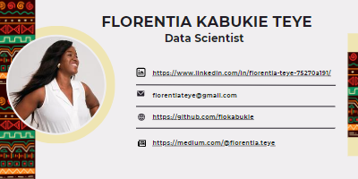

# Azubian-Customer-Churn-Prediction-Challenge

Customer Churn Prediction for an African Telecommunications Company that offers airtime and mobile data bundles. The company wants to develop a machine learning model that can accurately predict the likelihood of each customer "churning" – becoming inactive and not making any transactions for 90 days.

## **What is Customer Churn?**

Customer churn prediction refers to the process of using data analysis and predictive modeling techniques to identify customers who are likely to stop using a product or service. Churn, in this context, refers to customer attrition or the loss of customers from this African Telecommunications Company

**Project by Team Serene**

### **Project Process**

### **Getting our Data**

The data was dowloaded from Zindi as a challenge.

To understand the data, we went through the variable definitions of the given columns which contains information related to telecommunications customers, including their region, tenure, recharge amount, frequency of recharge, revenue, data usage, and other variables.

## Summary
| Code      | Name        | ML Development Notebook|App Development| Deployed App | PowerPoint Presentation of Challenge |
|-----------|-------------|-------------:|-------------:|-------------|-------------|
 [Project Notebook](https://github.com/acheampongmaa/Azubian-Customer-Churn-Prediction-Challenge/blob/main/Team%20Serene%20Capstone%20Project%20Notebook.ipynb/)  |[Gradio App Notebook](https://github.com/acheampongmaa/Azubian-Customer-Churn-Prediction-Challenge/blob/main/Team%20Serene%20Capstone%20Project%20Gradio%20App%20Notebook.ipynb/) |[Customer Churn App with Gradio](https://huggingface.co/spaces/Queensly/Customer_Churn/)| [PowerPoint Presentation]( https://github.com/acheampongmaa/Azubian-Customer-Churn-Prediction-Challenge/blob/main/Team%20Serene%20Capstone%20Project%20PowerPoint%20Presentation.pptx/) |

 

## **Author**
#### **Florentia Teye**
Florentia Teye is a Data Scientist with experience in data analysis and machine learning. She has a Bachelor's of Education degree in Mathematics and has worked on several open-source projects. In her free time, she enjoys teaching, researching new niches and writing. If you have any questions or suggestions, feel free to reach out to her on GitHub or LinkedIn.

#### **This is a link to the deployed app** 

 