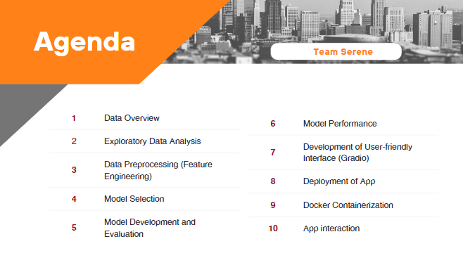
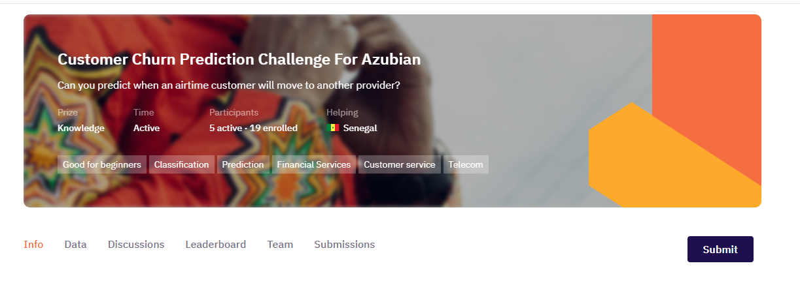
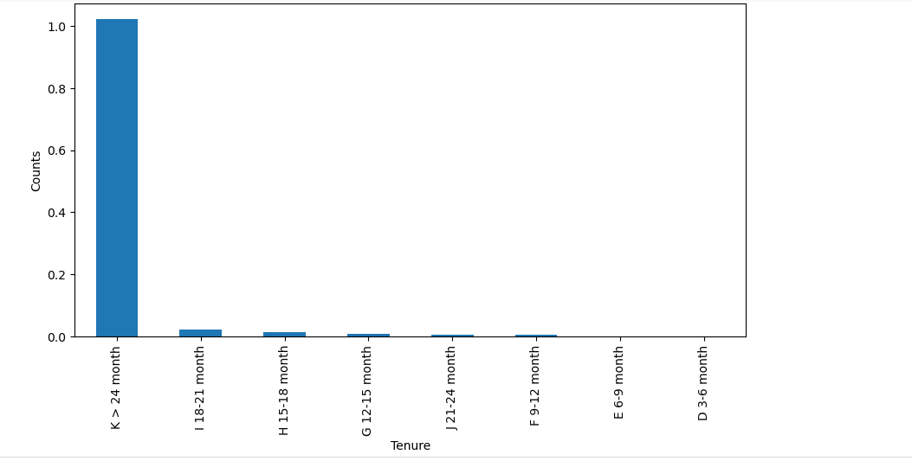
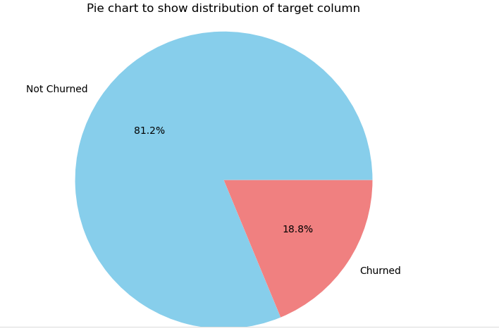
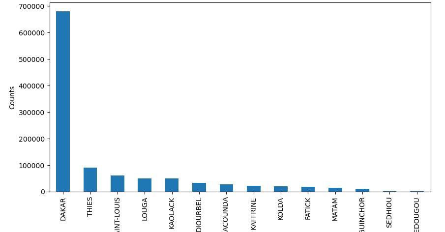
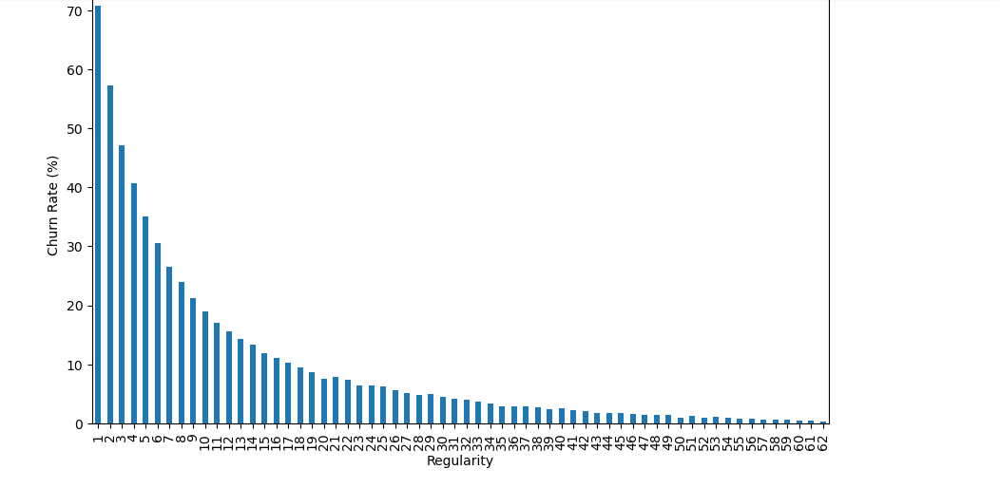
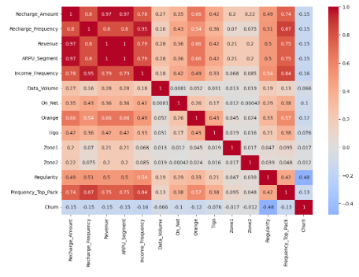

# Azubian-Customer-Churn-Prediction-Challenge

Customer Churn Prediction for an African Telecommunications Company that offers airtime and mobile data bundles. The company wants to develop a machine learning model that can accurately predict the likelihood of each customer "churning" – becoming inactive and not making any transactions for 90 days.

## **What is Customer Churn?**

Customer churn prediction refers to the process of using data analysis and predictive modeling techniques to identify customers who are likely to stop using a product or service. Churn, in this context, refers to customer attrition or the loss of customers from this African Telecommunications Company

## **Project Objective:**

The objective of this challenge is to develop a machine learning model to predict the likelihood of each customer “churning,” i.e. becoming inactive and not making any transactions for 90 days.

### **Hypothesis**

Null hypothesis(H0): There is no significant relationship between the customers' characteristics and the churn rate. In other words, the variables in the dataset have no impact on customer churn.

**Alternative hypothesisH1):** 

There is a significant relationship between the customers' characteristics and the churn rate. The variables in the dataset have an impact on customer churn.

**Business Questions****
1. What is the overall churn rate of the company?
2. Which region has the highest representation?
3. Which tenure has the highest representation?
4. Does the length of tenure (months) affect the churn rate of customers?
5. Which Region has most clients churning?
6. Do client churn or not churn if active for 90 days (Regularity)?
7. What's the correlation between the various features?

### **Project Process**

### **Getting our Data**

The data was dowloaded from Zindi as a challenge.

To understand the data, we went through the variable definitions of the given columns which contains information related to telecommunications customers, including their region, tenure, recharge amount, frequency of recharge, revenue, data usage, and other variables.

### **Exploratory Data Analysis**

EDA (Exploratory Data Analysis) for this Project  involved analyzing and understanding the dataset to gain insights into the variables and their relationship with customer churn. It helped the team in identifying patterns, trends, anomalies, and correlations within the data, which informed feature selection, model building, and decision-making. Below are some visualizations of the EDA performed with a summary of insight gathered.

   

From the EDA performed we realized that the data is imbalanced since the number of customers who aren't churning made up the majority of the dataset.

In dealing with this issue:

1. All other evaluation metrics will be used except 'accuracy' since it will be in favour of the majority class

2. The type of machine learning algorithms that will be used are the Tree based models and other regression models.

### **Feature Engineering**

Feature engineering involves transforming the dataset into a format suitable for training a machine learning model. This includes handling missing values, scaling numerical features, and encoding categorical variables. Additionally, there may be the need to create new features or extract relevant information from existing ones to improve the model’s predictive power.

For this project, some of the steps taken in feature engineering include the following;

1. Imputation of missing data
Encoding of categorical variables

2. Transformation of variables
Discrete variable discretization

3. Taking Care of Outliers

4. Scaling of numerical features
5. Creating new features 
6. Feature extraction 

The raw dataset was then transformed into a well-structured set that can enhance the accuracy and effectiveness of the sepsis prediction model embedded within the app.

### **Model Selection**
In this Customer Churn Prediction Project, it is imperative to choose an appropriate machine learning algorithm. Since this Project is a classification Project, some common algorithms best for it include logistic regression, random forests, support vector machines, and gradient boosting algorithms. Different models need to be evaluated using suitable performance metrics (ROC_AUC) to determine which one performs best for this project.

Five (5) of these Algorithms were trained, evaluated and compared;

1. Logistic Regression
2. Random Forest Classifier
3. Gradient Boosting Classifier
4. K Nearest Neighbors
5. Decision Tree Classifier

### **Model Hyperparameter Tuning**

Hyperparameter tuning is important in machine learning models because they help to control their behavior and performance. Tuning these hyperparameters can significantly impact the model’s predictive power.

In performing hyperparameter tuning, the training data is divided into a set for training and a set for testing the hyperparameters, which is also known as the validation set. 